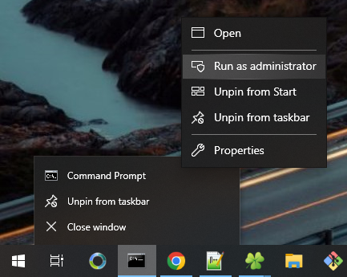
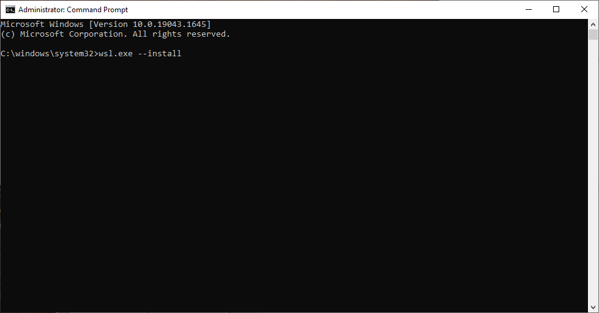
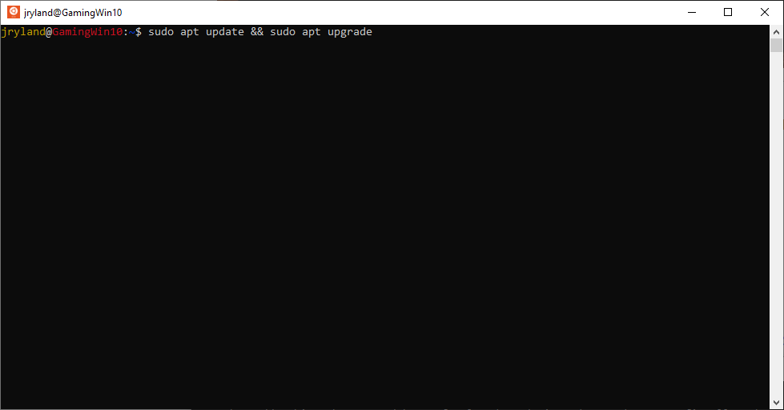
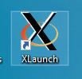
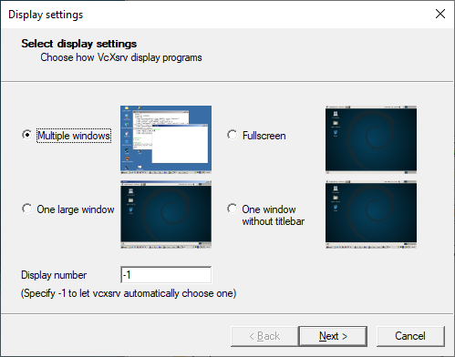
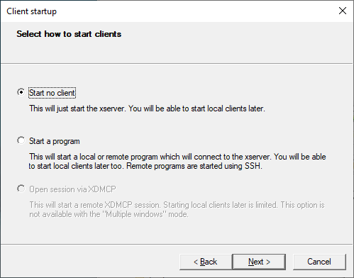
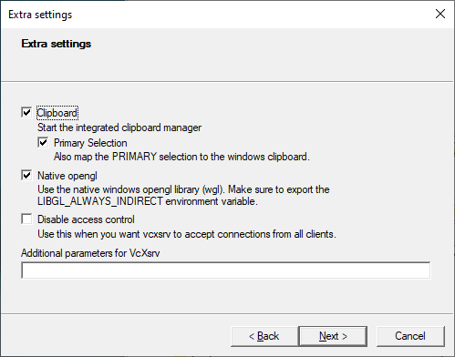
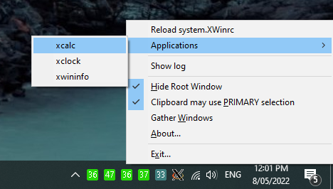
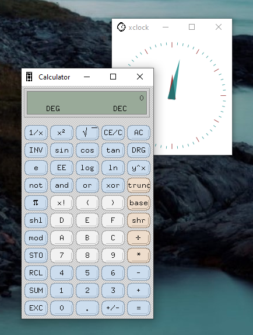
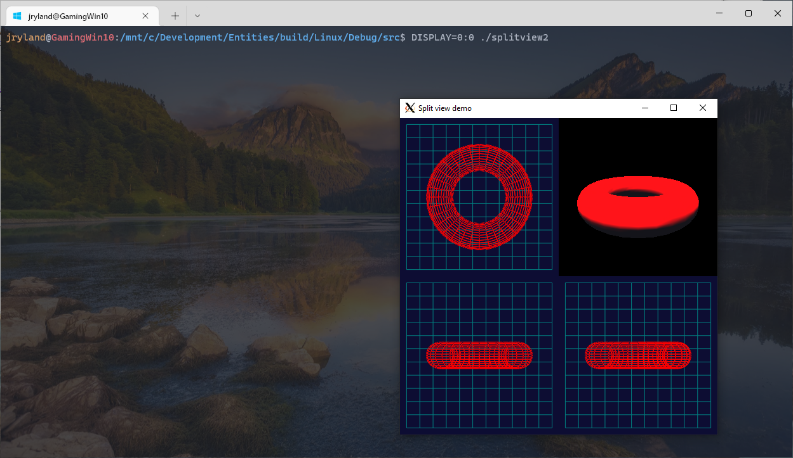

# Setting up a development environment

Set up for a development environment on different platforms


# Getting started

It is not assumed that you have git installed, however this is a git repository,
so the suggested way to get started is to download and run the applicable init script.

On macOS and Linux, downloading and running this should bootstrap everything:
  https://raw.githubusercontent.com/JohnRyland/DevelopmentEnvironment/main/init.sh

On windows, running this should bootstrap being able to then run init.sh which it downloads:
  https://raw.githubusercontent.com/JohnRyland/DevelopmentEnvironment/main/init.bat

To download, right click on the link above, and choose 'Save Target As'. When it
finishes downloading, you can open it to run it. Windows might want to not save it, you
have to choose 'keep', and it might show a dialog that it is not safe to run, click on
'more info' and then click on 'run anyway'. Then the command prompt will display and start
installing everything.

This requires that you have Windows 10, and it has been updated. A fresh install of
Windows 10 version 1709 won't work until it has been updated. Keep checking and
installing windows updates until the version is upgraded to version 20H2 or better.

# Running the scripts

There is an init.sh script here that can detect the platform and install the
various packages. On Linux and macOS, the script can run natively. On Windows
the script however requires a shell to be installed first.

If you have a shell already installed, then run this:

```
./init.sh
```

Otherwise on Windows run the init.bat script, it will install git-for-windows
which includes bash and will then call the init.sh script.

```
init.bat
```

On Windows, Linux and macOS this will install make, cmake, python, compilers, git, doxygen,
pandoc, ctags, cppcheck, sqlite and a number of other tools and utilities.

On Windows this will additionally install a number of desktop applications, including
Windows Terminal, Git Bash and VcXsrv. These are installed to %USERPROFILE%/scoop/apps and
can be launched from the start menu.

These manual installation instructions are now deprecated.


## Windows 10

### Recommended Tools:

 - WSL2
 - Windows Terminal
 - Git Bash
 - VcXsrv

### Installation of these Tools:


#### WSL2:

Run CMD as administator

Right click the icon, then right click again on 'Command Prompt' in the menu:



and then run:

```
wsl.exe --install
```



Now update:

```
sudo apt update && sudo apt upgrade
```




#### Windows Terminal:

A terminal emulator which supports cmd.exe, powershell, ttys, ssh sessions.

If manual installation is required:

Install from windows store from here:  https://aka.ms/terminal


#### Git for windows:

A msys based system which provides bash and basic unix tools as well as git.

If manual installation is required:

Install latest package from here: https://github.com/git-for-windows/git/releases/latest
eg: https://github.com/git-for-windows/git/releases/download/v2.36.0.windows.1/Git-2.36.0-64-bit.exe


#### VcXsrv:

An X server for Windows

https://sourceforge.net/projects/vcxsrv/

If manual installation is required:

Install from here https://sourceforge.net/projects/vcxsrv/files/latest/download

After it is installed there should be an icon for running it:



Double-click on the icon, then choose 'Multiple Windows':



And then choose 'No Client':



Accept the defaults:



Now test it works by running the included X apps:



Wait a short time, and verify that the apps can run and appear similar to this:




### Usage:

To use, from inside of WSL, set the DISPLAY environment variable to 0:0, and then run the X application.

```
DISPLAY=0:0 ./splitview2
```

If it works, the Linux application running inside of WSL will be able to display from the X server running in Windows:




